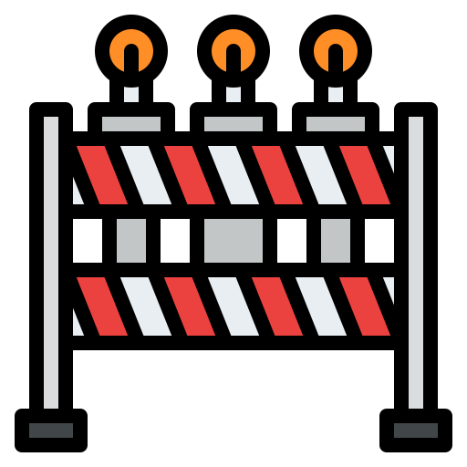

<div align="center">

<h1 style="color:red">Under Construction</h1>
</div>

# EasyBlog

Creating and maintaining blog sites should be easier than writing posts

> ## The Readme file will be updated when the project is complete

### Post Structure

```md
<!--
title: Hello World (Required)
date: 31 July, 2020
author: KhanShaheb34
thumbnail: thumb.jpg
summary: This is a post saying hello to the world.
-->

Your full post in markdown should be here.
```
